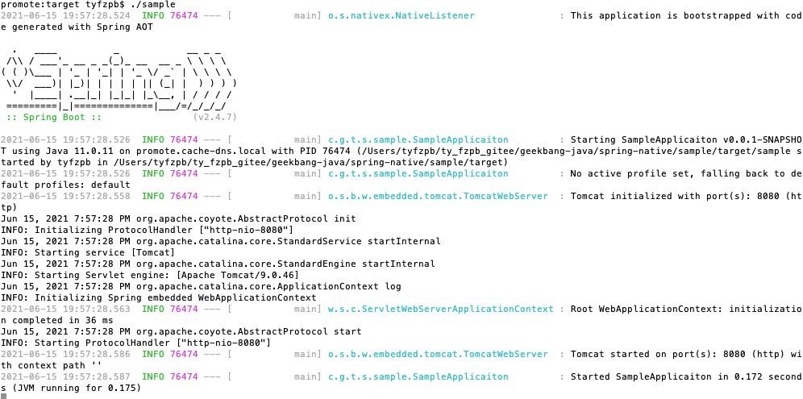

## 通过 GraalVM 将一个简单 Spring Boot 工程构建为 Native Image，要求：
- 代码要自己手写 @Controller
- @RequestMapping("/helloworld")
- 相关插件可以参考 Spring Native Samples
- （可选）理解 Hint 注解的使用


### 完成情况：
- 已实现。
  - 环境说明：
      - macOS BigSur 11.4
      - graalvm-ce-java11-darwin-amd64-21.1.0
      - maven 3.6.3
  - 最终编译生成文件为[sample](https://gitee.com/ty-fzpb/geekbang-java/tree/soa/spring-native/sample/target/sample)
  - ./sample 启动
    
  - 浏览器访问[http://127.0.0.1:8080/hello](http://127.0.0.1:8080/hello)
    
    
### 安装编译流程
  - 1、安装 GraalVM
    - 1、下载软件包 [https://www.graalvm.org](https://www.graalvm.org) 下载[graalvm-ce-java11-darwin-amd64-21.1.0](https://github.com/graalvm/graalvm-ce-builds/releases/download/vm-21.1.0/graalvm-ce-java11-darwin-amd64-21.1.0.tar.gz)
    - 2、解压缩软件包
      ```shell
        tar -xzf graalvm-ce-java11-darwin-amd64-21.1.0.tar.gz
      ```
    - 3、将解压缩的软件包移动到  /Library/Java/JavaVirtualMachines
      ```shell
        sudo mv graalvm-ce-java11-21.1.0 /Library/Java/JavaVirtualMachines
       ```
    - 4、多个JDK情况，建议配置如下环境变量：
      ```shell
        export MAVEN_HOME=/usr/local/apache-maven-3.6.3
        export JAVA_8_HOME=`/usr/libexec/java_home -v 1.8.0_211`
        export JAVA_11_HOME=`/usr/libexec/java_home -v 11.0.11`
        export JAVA_11_GRAALVM_HOME=/Library/Java/JavaVirtualMachines/graalvm-ce-java11-21.1.0/Contents/Home
        export JAVA_HOME=$JAVA_8_HOME
        export PATH=$JAVA_HOME/bin:$PATH:$MAVEN_HOME/bin
        alias jdk8="export JAVA_HOME=$JAVA_8_HOME;export PATH=$JAVA_8_HOME/bin:$PATH"
        alias jdk11="export JAVA_HOME=$JAVA_11_HOME;export PATH=$JAVA_11_HOME/bin:$PATH"
        alias jdk11_graalvm="export JAVA_HOME=$JAVA_11_GRAALVM_HOME;export PATH=$JAVA_11_GRAALVM_HOME/bin:$PATH"
      ```
      - 直接可以在命令行使用jdk8、jdk11、jdk11_graalvm切换jdk版本，方便使用

    - 5、如果您使用的是 macOS Catalina 及更高版本，需要运行以下操作：
      ```shell
        jdk11_graalvm
        sudo xattr -r -d com.apple.quarantine $JAVA_HOME
      ```
      - ps: 其中 $JAVA_HOME 是graalvm所在目录
  
    -6、编译spring-native sample项目
      ```shell
        jdk11_graalvm
        mvn -Pnative package
      ```
      - ps: 等待时间较长，native image 编译耗时耗CPU耗内存，建议至少8G的机器