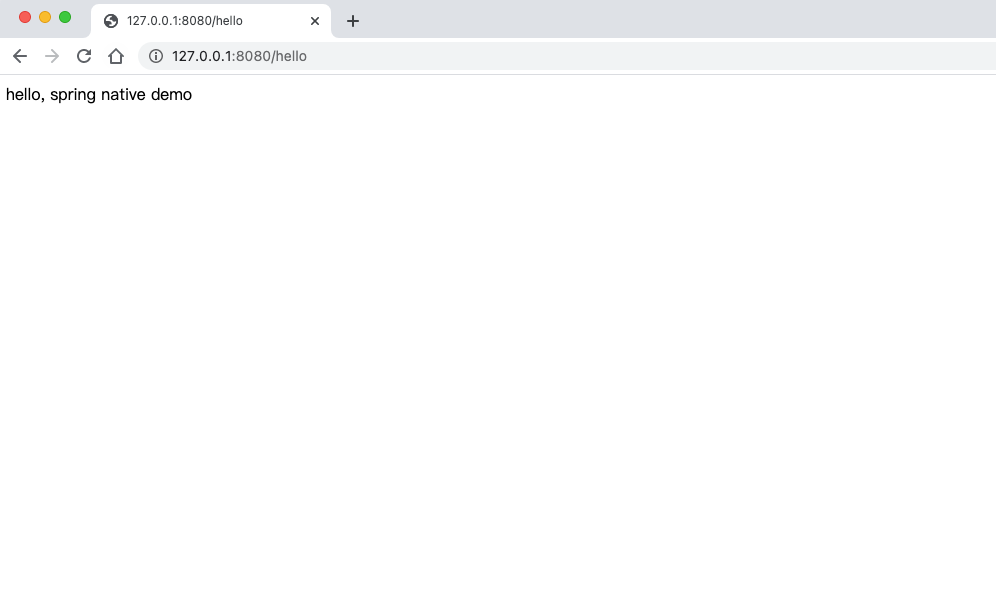

## 通过 GraalVM 将一个简单 Spring Boot 工程构建为 Native Image，要求：
- 代码要自己手写 @Controller
- @RequestMapping("/helloworld")
- 相关插件可以参考 Spring Native Samples
- （可选）理解 Hint 注解的使用

### 完成情况：
- 已实现。
  - 环境说明：
      - macOS BigSur 11.4
      - graalvm-ce-java11-darwin-amd64-21.1.0
      - maven 3.6.3
  - 最终编译生成文件为[sample](https://gitee.com/ty-fzpb/geekbang-java/tree/soa/spring-native/sample/target/sample)
  - ./sample 启动
    
  - 浏览器访问[http://127.0.0.1:8080/hello](http://127.0.0.1:8080/hello)
    
    
