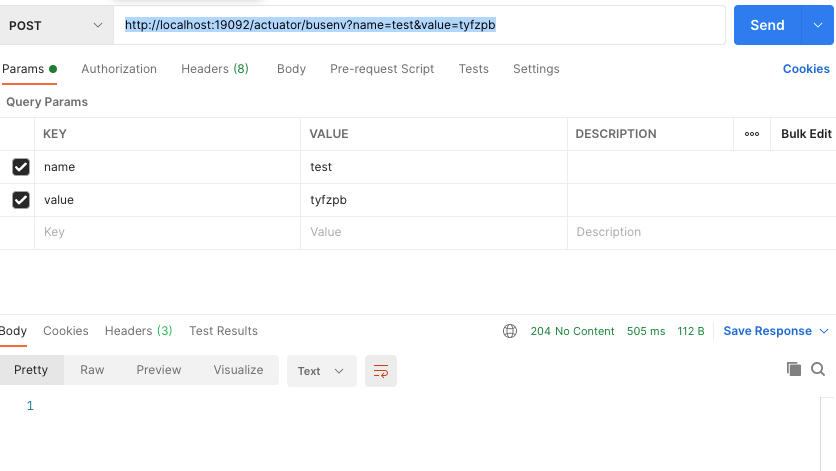
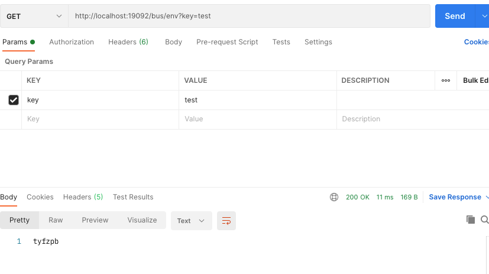
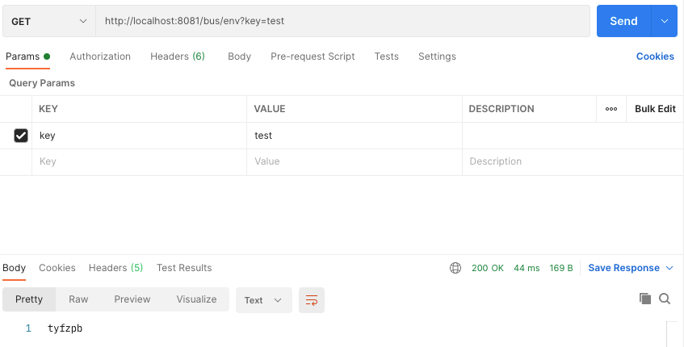

## 第十四周作业说明：
### 利用 Redis 实现 Spring Cloud Bus 中的 BusBridge，避免强依赖于 Spring Cloud Stream
- 难点：处理消息订阅
- 目的：
  - 回顾 Spring 事件
  - 理解 Spring Cloud Bus 架构
  - 理解 Spring Cloud Stream


### 完成情况：
- 已实现。

  - spring-could-bus-redis 模块 实现自动加载 Spring Cloud Bus redis实现
    - [ReidsBusAutoConfiguration](https://gitee.com/ty-fzpb/geekbang-java/tree/soa/user-platform/spring-cloud-projects/spring-cloud-bus-redis/src/main/java/org/geektimes/projects/spring/cloud/bus/redis/RedisBusAutoConfiguration.java) 实现自动加载
      并且[META-INF/spring.factories](https://gitee.com/ty-fzpb/geekbang-java/tree/soa/user-platform/spring-cloud-projects/spring-cloud-bus-redis/src/main/resources/META-INF/spring.factories) 添加
      ```properties
      org.springframework.boot.autoconfigure.EnableAutoConfiguration=\
      org.geektimes.projects.spring.cloud.bus.redis.RedisBusAutoConfiguration,\
      org.geektimes.projects.spring.cloud.bus.redis.RedisMessagePubSubListener
      ```
    - [ReidsBusBridge](https://gitee.com/ty-fzpb/geekbang-java/tree/soa/user-platform/spring-cloud-projects/spring-cloud-bus-redis/src/main/java/org/geektimes/projects/spring/cloud/bus/redis/RedisBusAutoBridge.java) 实现 BusBridge
      ```java
      @Override
      public void send(RemoteApplicationEvent event) {
      String destination = properties.getDestination();
      destination = destination == null ? "defaultRedisData" : destination;
      Jedis jedis = (Jedis) redisCacheManager.getMissingCache(destination).getNativeCache();
  
          Map<String, String> map = ((EnvironmentChangeRemoteApplicationEvent) event).getValues();
          try {
              String jsonData = objectMapper.writeValueAsString(map);
              jedis.publish(destination, jsonData);
          } catch (Exception e) {
              throw new RuntimeException(e);
          }
      }
      ```
      - [RedisMessagePubSubListener](https://gitee.com/ty-fzpb/geekbang-java/tree/soa/user-platform/spring-cloud-projects/spring-cloud-bus-redis/src/main/java/org/geektimes/projects/spring/cloud/bus/redis/RedisMessagePubSubListener.java) Redis发布订阅消息监听器，consumer订阅消息，然后处理添加至本地environment
    - spring-cloud-service-provider 模块
      - pom.xml添加 spring-cloud-bus-redis 依赖，自动激活
        ```xml
        <dependency>
              <groupId>org.geekbang.projects</groupId>
              <artifactId>spring-cloud-bus-redis</artifactId>
              <version>${version}</version>
          </dependency>
        ```
      - [ServiceProvider](https://gitee.com/ty-fzpb/geekbang-java/tree/soa/user-platform/spring-cloud-projects/spring-cloud-service-provider/src/main/java/org/geektimes/projects/spring/cloud/service/provider/ServiceProvider.java) 添加如下代码用于测试：
        ```java
        @GetMapping("/bus/env")
        public String envValue(@RequestParam("key") String key) {
        return applicationContext.getEnvironment().getProperty(key, "NULL");
        }
        ```

    - spring-cloud-service-consumer 模块
      - pom.xml添加 spring-cloud-bus-redis 依赖，自动激活
      ```xml
      <dependency>
      <groupId>org.geekbang.projects</groupId>
      <artifactId>spring-cloud-bus-redis</artifactId>
      <version>${version}</version>
      </dependency>
      ```
      - [ServiceConsumer](https://gitee.com/ty-fzpb/geekbang-java/tree/soa/user-platform/spring-cloud-projects/spring-cloud-service-consumer/src/main/java/org/geektimes/projects/spring/cloud/service/consumer/ServiceConsumer.java) 添加如下代码用于测试：
        ```java
        @GetMapping("/bus/env")
        public String envValue(@RequestParam("key") String key) {
        return applicationContext.getEnvironment().getProperty(key, "NULL");
        }
        
        @Bean
        public ApplicationRunner runner() {
          return args -> {
          RedisCacheManager redisCacheManager = new RedisCacheManager(DEFAULT_REDIS_CONNECTION_STRING);
          Jedis jedis = (Jedis) redisCacheManager.getCache("defalut").getNativeCache();
          jedis.subscribe(redisMessagePubSubListener,"defaultRedisData","springCloudBus");
          };
        }
        ```
    - 测试过程：
      1、启动服务：EurekaServer、ServiceProvider、ServiceConsumer
      2、请求地址：
        http://localhost:19092/bus/env?key=test 
        - 返回为NULL   
        http://localhost:8081/bus/env?key=test
        - 返回为NULL  
      3、执行POST请求 http://localhost:19092/actuator/busenv?name=test&value=tyfzpb
          
          ServiceConsumer 控制台会输出如下：
          ```shell
           onMessage: [channel :springCloudBus, message : {"hello":"tyfzpb"}]
          ``` 
      4、 再次执行Get请求 http://localhost:19092/bus/env?key=test
          
          http://localhost:8081/bus/env?key=test
          
      
  